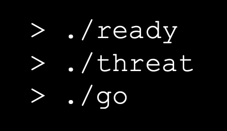

# Ready Threat Go - Splunk App for Threat Simulation & Detection Validation

Ready Threat Go (RTG) is a Splunk app developed as an augmentation to the Splunk Common Information Model (CIM) and related datamodels. The app is designed to allow threat researchers and engineers to quickly and routinely test detection logic within Splunk without the technical and financial requirements of a lab or BAS solution. This app aims to accomplish the following goals:

1. Enable security teams to simulate custom threat data within their SIEM to understand where they stand in detection coverage
2. Provide a public repository of observed threat artifacts (sample SIEM events) for immediate use
3. Map individual Threat Events (TE) and Threat Sets (TS) to detection coverage and easily/routinely run the simulations to identify changes or gaps in detection coverage

## How it Works
Threat Events or Threat Sets (simulations involving more than a single event like port scanning) are stored in lookups. There is a lookup for each data type, as shown below:
> 1. Endpoint Processes
> 2. Network Traffic
> 3. Web Proxy

The lookups contain the fields and values for each event. The contents of these lookups are retrieved by hourly searches that then output the events to the "readythreatgo" summary index. Once the events are in the summary index the data will seamlessly filter into the respective datamodels where detections will then fire. 

## Initial Setup
There is just one step to configure the datamodels to use the simulation data:
> * The "readythreatgo" index needs to be added to the datamodels' constraints

This is done either in the CIM Datamodel macros such as `cim_Network_Traffic_indexes` or via the CIM app setup GUI. This should take less than 10 seconds per datamodel and look something like this when complete: `index IN (network,firewall,readythreatgo)`.

That's it for setup! After that you're ready to go. The built-in scheduled searches will simulate the events in the lookups hourly but you can also manually run them if needed.

> NOTE: After first installing the app, the hourly searches that simulate the events will not run for a full hour. If you don't want to wait you can click run for each one in the native scheduled searches pane

## Newly Released Features & Future Items
This app has come a long way already. The most recent update adds native eventtypes and tagging for the simulations in the `readythreatgo` index so the events are compatible with the datamodels out of the box with no extra setup. This reduced the onboarding to just the single step of adding the index to the datamodels' macros. This one step will remain manual as RTG automatically deploys simulations and I'd like to avoid giving some SOC somewhere an absolute heart attack. Adding the index to the datamodel macros manually ensures you're aware that simulation telemetry will be enabled and generating alerts so no one blows through their IR retainer thinking the sky is falling :)

While the start of this app is focused on datamodel support, I will 100% be adding in index-level event support for things that often sit outside the datamodels. This will allow you to add in sample events like Defender/Crowdstrike alerts, raw Wineventlog, etc. I realize that Splunk can be used in many different ways and I aim to build as much flexibility into the app as possible to enable security teams to use it whether they're 100% datamodel-based and CIM compliant or just keyword searching at index level (hey, we all started somewhere).
